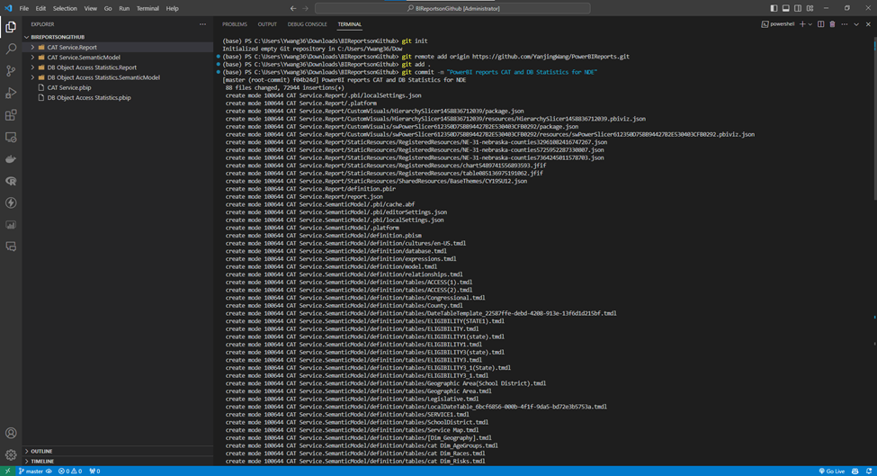
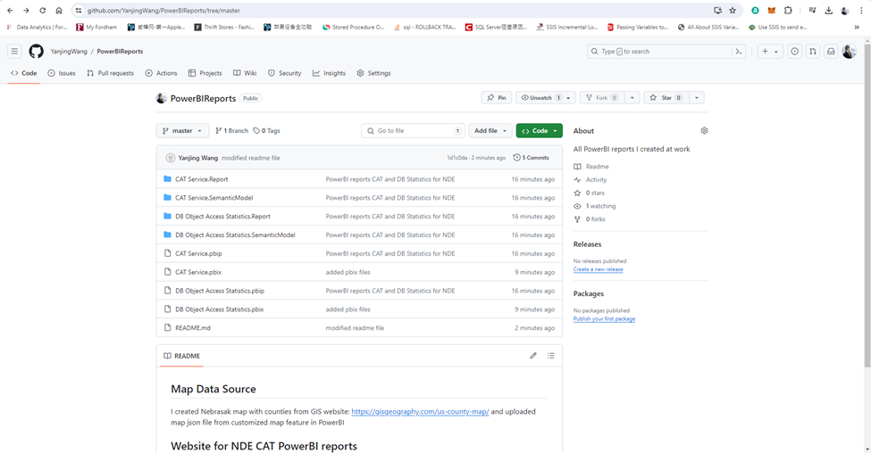
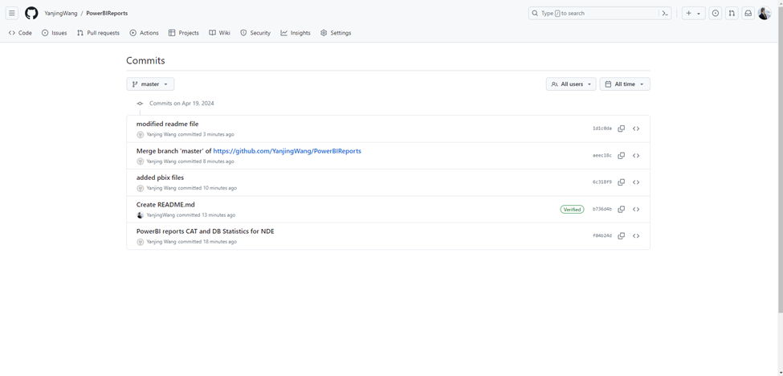
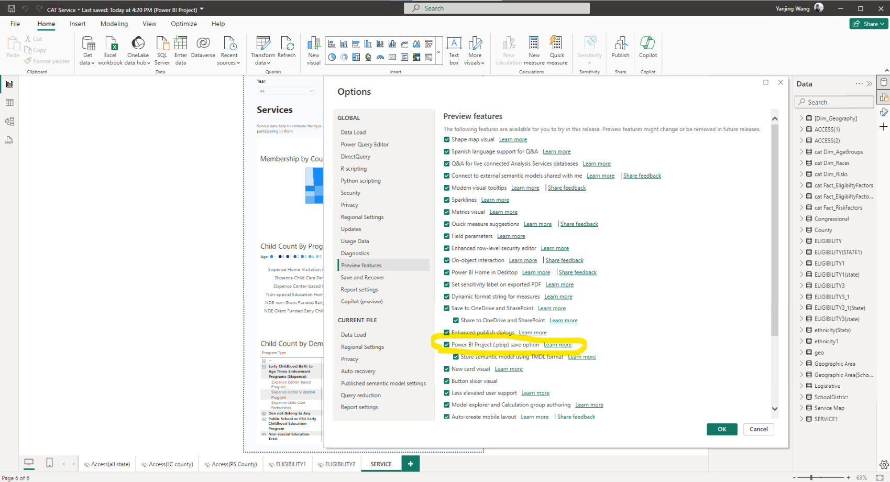
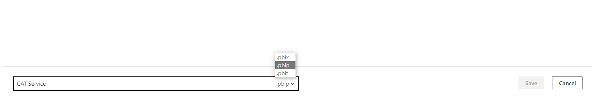
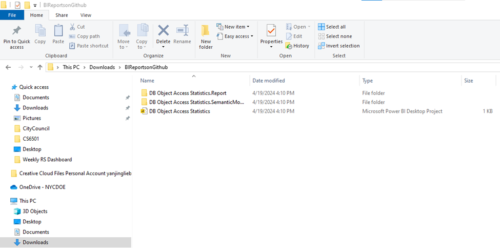
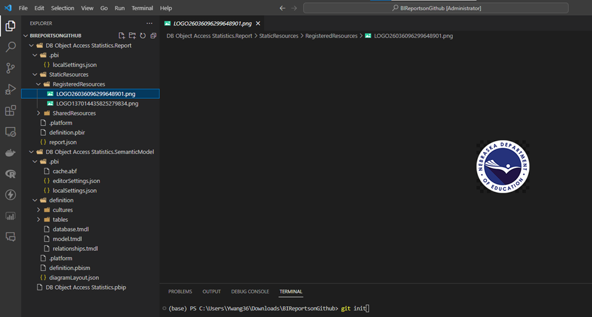
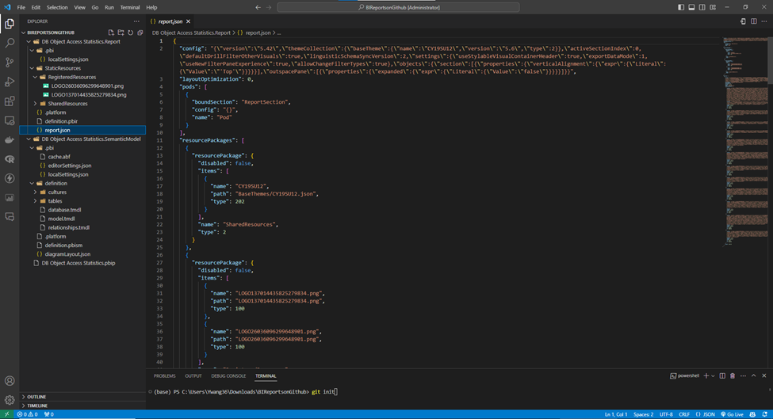

## Map Data Source

I created Nebrasak map with counties from GIS website: https://gisgeography.com/us-county-map/ and uploaded map json file from customized map feature in PowerBI

## **Website for NDE CAT PowerBI reports**

https://ecdata.education.ne.gov/ or https://ecids.nebraska.gov/Data-Explorer/

## **How to use Git to control version**

1. Install Git from https://git-scm.com/downloads
2. Open terminal / Powershell / Code editor: git init
3. Change directory to your want: cd C:\Users\Download
4. Clone repository to your local: git clone https://github.com/YanjingWang/PowerBIReports.git or simply download it from Github UI
5. After making changes remmeber to upload new versions: git add . (add all changes) or git add "CAT Service.pbix" (specific file name)
6. Store changes to staging phase: git commit -m "modified CAT Services pbix by changing slicers"
7. Upload changes for new version to Github: git push origin master (assuming you are pushing it to master branch)
8. Check the version hash: git log -1
   

   

   9.Track changes and revert previous versions

   

## Pre requirment for PowerBI desktop

1. Download the latest PowerBI desktop from [Download Microsoft Power BI Desktop from Official Microsoft Download Center](https://www.microsoft.com/en-us/download/details.aspx?id=58494?id=58494)
2. Open desktop and choose Options and Setting
3. Click Preview Features and Enable PowerBI Projects and restart desktop
4. Save reports as pbip format

   

   

   

   

   

   ## **PowerBI version control tools analysis**

   ##### **Azure DevOps by using Git (DOE email is blocked)**

   **Pros:**

   1.Easy to do version control and track the changes

   2.Integrated with pbix and data to the same platform

   3.Cloud storage

   4.Team work collabration: can create different branchs for different contributors and different environments like development, testing and production and different branches for different people, everyone may work a part of it and merge it to main branch eventually

   5.Permission control, avoid unrelated people accidentally mess up work

   6.Automation refresh

   **Cons:**

   1.Learning curve: git command lines: commit, rollbacks, pull requests, pushes

   2.DOE Email Id was temporarily blocked access to Azure DevOps

#####    Github

    **Pros**: as aboved mentioned

    **Cons**: can not directly view reports through Github
